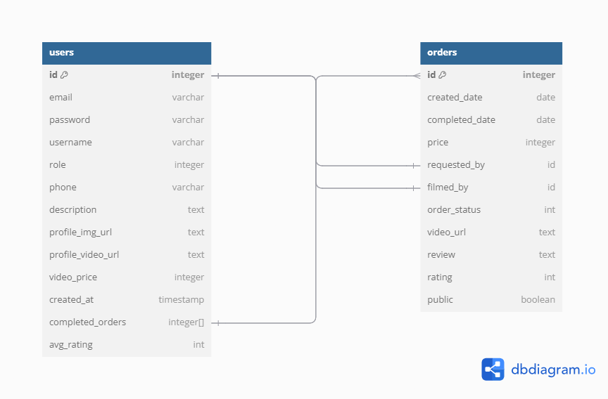

# Entity Relationship Diagram

Reference the Creating an Entity Relationship Diagram final project guide in the course portal for more information about how to complete this deliverable.

## Create the List of Tables

[👉🏾👉🏾👉🏾 List each table in your diagram]
1. users
2. orders

## Add the Entity Relationship Diagram

[👉🏾👉🏾👉🏾 Include an image or images of the diagram below. You may also wish to use the following markdown syntax to outline each table, as per your preference.]

Note:
- In the users table, we represent the role of the user by interger. (1: customer, 2: celebrity, 3: admin).
- Only the celebrity account will store the information of "description, profile_video_url, completed_orders, and avg_rating".
- In the completed_orders field, it will store an array of orders_id for accessing the review and rating from the customer, and also public videos.

- In the orders table, the requested by field will store the customer's user_id, and the filmed_by field will store the celebrity's user_id.
- The order_status uses integer to represent the current status of the order.

| Column Name | Type | Description |
|-------------|------|-------------|
| id | integer | primary key |
| name | text | name of the shoe model |
| ... | ... | ... |
